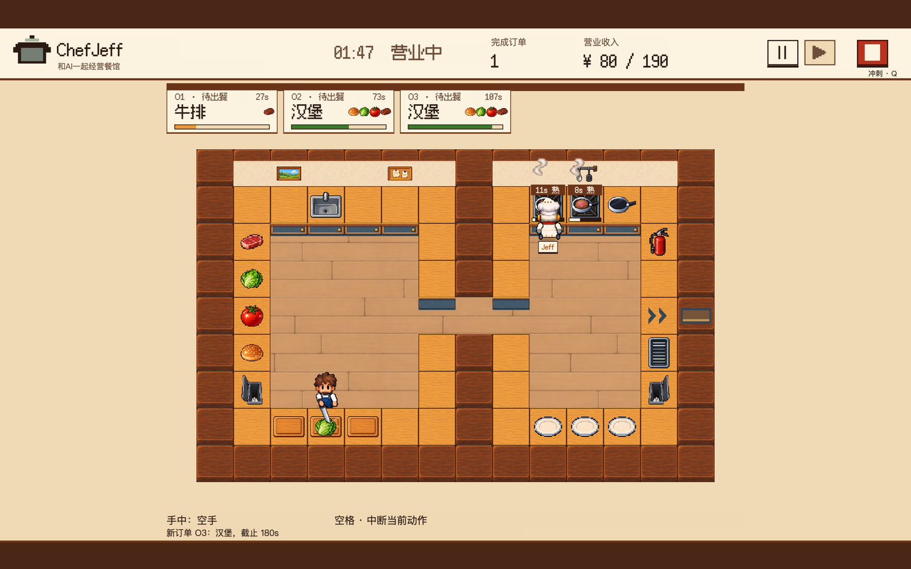

# ChefJeff · 一起出餐

[English](README.md) · 中文

什么是不可计算的？当计算机问世的时候我们似乎就在问这个问题，到底有哪些事情是计算机做不到的？
我的第一反应就是烹饪。计算机知道怎么做饭吗？现在我们可以问，AI会做饭吗？

ChefJeff 是一个实时的人与 AI 合作烹饪游戏，也是一套可以扩展的人机协作实验环境。把AI和人放在一个环境中，考验协作而不是对抗，我们试图为理解一个人机共生的世界提供一个可视化的实验环境，并希望在开源社区的激荡中不断完善一个开源的人机协作Benchmark，如果你是一名人机交互、人因工程或者人机传播的研究者也欢迎使用我们的环境来展开相关研究。



你可以从这里开始：[本地运行](#本地运行) · [接入自己的模型](#jeff-与模型接入) · [修改配置](#五个数据模型) · [实验环境与 Benchmark](#人机协作实验环境的搭建与-benchmark)

> 当前版本 **0.6.0-beta.1**，首次公开测试版。运行时需要自己配置模型 API，接口和分析规则仍可能调整。建议优先调用Jev模型，尽管表现差强人意，但是胜在便宜，其他模型表现如何欢迎评测。

---

## 本地运行

需要 Python 3.10 或更高版本、一台带键盘的电脑，以及支持 WebGL 的浏览器。后端只用到 Python 标准库；网页已经构建好放在仓库里，普通试玩不需要重新构建。

```sh
git clone https://github.com/belchingleo/ChefJeff.git
cd ChefJeff
python3 scripts/launch_web.py
```

Windows 上用 `py -3 scripts/launch_web.py`。也可以直接双击 `start-web.command`（macOS）或 `start-web.bat`（Windows）。

然后在浏览器打开 <http://127.0.0.1:8775/>，在「设置」里填上你自己的模型 API，测试连接成功后就能开局。ChefJeff 提供 TypeSafe Jev 接口和兼容 Chat Completions 的接口；换用其他模型时，需要自己试一下它能不能按要求输出动作、响应够不够快。

> **关于费用**：测试连接和每一局游戏，调用的都是你自己的模型账号，费用由这个账号承担。默认每局最多调用 200 次（可以在 1 到 2000 次之间调整），这是次数上限，不是金额上限。这是实时游戏，厨房时刻都在运转，所以如果模型太慢的话，Jeff 大多数时间都只会停在原地思考。

目前实际测试过的环境：macOS 15.6、Python 3.12、Chromium 内核浏览器，模型用的是 TypeSafe Jev（jev-latest）和 DeepSeek V4.1-Flash。其他系统和模型还没有逐一验证，欢迎反馈。

---

## 游戏玩法

ChefJeff 的玩法和《胡闹厨房》很像：两个人一起做菜，但区别是另一位厨师由 AI 控制。

你用键盘操作一名厨师：走动、取食材、切菜、下锅、装盘、出餐、洗盘子。Jeff 是另一名厨师，由大模型驱动，每隔数秒自己决定接下来做什么。两人在同一间厨房里，遵守同样的物理规则（移动速度、扔东西的距离、碰撞），但看厨房和操作的方式不同，见 [Jeff 与模型接入](#jeff-与模型接入)。

每局限时 180 秒。订单每隔一段时间来一张，每张都有倒计时，超时会扣钱。净收入达到目标也不会提前收工，厨房一直营业到关店，按关店时的净收入判定是否过关，所以达标之后，你和 Jeff 还可以继续冲击更高的金额。

| 关卡 | 菜单 | 这一关的特点 | 目标 |
| --- | --- | --- | --- |
| 第一关 · 牛排 | 牛排 ¥50 | 练手关，熟悉切、煎、装盘、出餐 | ¥150 |
| 第二关 · 汉堡 | 汉堡 ¥80 | 一排长柜台把厨房隔成两半，很多东西得隔着柜台递 | ¥150 |
| 第三关 · 牛排和汉堡 | 牛排、汉堡 | 两个灶台、三口平底锅，两道菜可以同时做 | ¥190 |

两个人可以这样协作：
切菜、下锅、装盘、出餐。过程中 Jeff 会选择传菜给你，或者和你一起切菜、传菜、洗碗，他也可能撞开你，想要自己处理某件事，当然你也可以这样做。
如果你对模型不满意，也可以按 1–6 告诉 Jeff 你想做哪类活，或者提醒他刚才做错了。

操作方式基本和《胡闹厨房》一样：

| 按键 | 作用 |
| --- | --- |
| WASD 或方向键 | 移动；移动时按 **Q** 冲刺 |
| 空格 | 对面前的东西做该做的事：取食材、拿起、放下、下锅、装盘、出餐，也能切菜和洗盘子 |
| E | 只做加工：切菜、洗盘子、灭火；面前没有可加工的东西、手里又拿着东西时，把它往前扔 |
| 1–6 | 告诉 Jeff 你想做哪类活，或者提醒他做错了 |
| Shift | 标记当前时刻，不暂停也不打断动作；导出本局时可以回看 |
| Esc 或 P | 暂停（iPad 键盘没有 Esc 键时用 P）。在设置里可以连接模型、切换语言、调音量、导出本局 |

每局结束后会弹出本局记录：你和 Jeff 各自取了多少次食材、切了几份、下了几次锅、出了几单、洗了几个盘子，以及两个人在出餐上各花了多少时间。

游戏有中文和英文界面，配有 8-bit 风格的音乐和音效。目前需要键盘，手机和纯触屏设备暂不支持，详见[设备支持](docs/device-support.md)；完整规则见[当前规则](docs/current-rules.md)。

---

## 技术基础

### 五个数据模型

这里的“模型”指内容配置，不是 AI 模型：

- **地图**：墙、柜台和各种设备放在哪里，从哪一面操作。
- **菜谱**：有哪些食材，哪些要切、哪些要煮，每道菜由什么组成（最多四样食材），卖多少钱。
- **订单**：来什么菜，隔多久来一张，每张能等多久。
- **设备**：每种设备能做什么，做得多快，能不能两个人一起用。
- **关卡**：把前面四样组合起来，再加上开局时的盘子和锅、目标金额和随机种子。

它们都是 `content/` 和 `maps/` 里的 JSON 文件，由 `schemas/` 校验；移动、扔东西、罚款这些通用规则写在 `rulesets/` 里。网页端的食材、菜品和设备名称也从这些数据读取。在现有引擎和 schema 支持的机制范围内，新关卡靠组合这些配置来做，不需要给某一关写特殊代码；超出现有机制的玩法仍然要扩展引擎。详见[配置契约](docs/architecture/configuration-contract.md)。

### Jeff 与模型接入

Jeff 不看画面，他读的是结构化的游戏状态，从当前合法的动作里选一个：

```
厨房当前状态（订单、工位、地上的东西、两名厨师各自在做什么）
        + 规则说明 + 此刻所有能做的动作
        ↓
      模型从中选一个动作（比如 "chop b1"、"assemble ground F2"）
        ↓
      厨房引擎检查这个动作是否合法，然后执行，结果写进事件记录
```

- **观察和控制方式不同。** 你实时按键，一步步走；Jeff 选的是“取食材”“切菜”“出餐”这样的整步动作，由引擎替他走过去完成。
- **默认的规则说明只讲事实。** 发给 Jeff 的内容全部是英文，两名厨师统一叫 `human` 和 `jeff`。规则说明只写能做什么、会发生什么，不预设分工，也不会给合作策略。
- **另外两类输入属于运行条件。** 你在游戏里按 1–6 发出的消息，以及滚动的跨局记忆（默认开启，可在设置里关闭或清空）带入的往局摘要，也会发给 Jeff。分析对局时，这些都会和规则说明分开记录。
- **每次决策都有记录：** 选了什么、有没有被接受、最后做没做完，分开记下，方便事后核对。

想接入自己的模型，只要实现 `payload(state, actions)` 和 `ask(payload)` 两个方法，见 [agent 接入](docs/agent-integration.md)。

### 记录与分析

1. **对局记录与重放**：开局时把本局配置固定下来并记下哈希，之后的每一步都记成一条事件流，和玩家的输入一起保存。用 `python3 collaboration_analyzer.py logs/sessions/<对局编号>` 可以不调用模型重放这一局，并核对重放结果和原始记录是否一致。重放只保证在同一版本内一致，旧版本的记录在新版本里可能重放出不同的结果。详见[对局记录](docs/architecture/session-record.md)。
2. **物品来历与协作分析**：引擎记下每份食材、每个盘子、每口锅经过了谁的手。按照现在定义的规则，从每道出了餐的菜往回追，可以算出每个动作和出餐的关系、两个人在出餐上各花了多少时间，以及在决定出餐快慢的“关键路径”上各占多少。这些结果可以重复计算，但“这算不算好的合作”仍需要人来解读：比如提前备好的料因为订单变化没用上，并不说明当时的准备没有道理。思路参考了 AgentWorld（arXiv 2609.31590）的 CCE 指标，详见[协作分析](docs/architecture/collaboration-analyzer.md)。

### 代码结构

| 模块 | 主要文件 |
| --- | --- |
| 厨房规则 | `kitchen.py`、`rules.py`、`config_contract.py` |
| 地图与空间 | `maps/`、`spatial_kitchen.py`、`navigation.py` |
| Jeff 的决策调度与模型适配 | `jev.py`、`whitebox_server.py`、`player_api.py`、`model_language.py` |
| 对局记录与分析 | `session_record.py`、`provenance.py`、`collaboration_analyzer.py`、`round_summary.py`、`capacity_analyzer.py` |
| 本地服务 | `web_server.py`、`cocos_server.py` |
| 画面与声音 | `cocos-kitchen/`（Cocos Creator 3.8.8，TypeScript） |

```sh
python3 -m unittest discover -s tests     # 离线测试（不调用付费模型）
python3 scripts/audit_release.py          # 发布前检查（密钥、私密文件）
python3 scripts/build_cocos.py web        # 重新构建网页，只有改了画面代码才需要（需要 Cocos Creator 3.8.8）
```

---

## 数据记录与收集

**本地运行：**ChefJeff 不会自动上传任何对局数据。所有记录都写在你自己的电脑上，分不分享由你决定。

| 记录 | 位置 | 内容 | 用途 |
| --- | --- | --- | --- |
| 对局记录包 | `logs/sessions/<对局编号>/` | 固定下来的配置、事件流、引擎输入、实际发给模型的请求 | 重放和协作分析；不含 API Key |
| 运行日志 | `logs/` | 完整的游戏状态和模型输出 | 排查问题；可能包含模型回复原文，分享前请检查 |
| 本局导出 | 暂停菜单 →「设置」→「导出本局」 | 按允许清单导出：版本和对局编号、时间、结果、调用次数与用量、事件计数、标记、预设沟通、最近的动作事件 | 附在 Issue 里反馈；不含 Key、模型地址、跨局记忆和完整的模型请求与回复 |
| 跨局记忆 | `.player-memory.json` | 同一模型最近三局，每局最多 18 条抽样事件 | 作为运行条件发给 Jeff；可在设置里关闭或清空 |

导出前会先显示预览。如果你愿意把对局贡献给研究，请在 Issue 里附上导出文件，并写明使用的模型和关卡；需要完整重放时，再按需提供对局记录包。

---

## 人机协作实验环境的搭建与 Benchmark

我们想用这个游戏回答一个问题：**在节奏快、有时间压力的场景里，人和 AI 是怎么协作的？**

- **更关心过程。** 出了几单是结果；我们想知道的是谁在什么时候接了哪份活，怎么回应对方，计划落空以后怎么补救。
- **不替 Jeff 安排合作。** 默认规则说明不预设分工，也不提供合作策略。会不会合作、怎么合作，正是要观察的。
- **两个方向都看。** 既观察 AI 怎么适应人，也观察人会怎么配合 AI。

### 为什么需要这样的 Benchmark

现在大多数 agent 评测考察的是“独自把一件事做完”：写代码、查资料、操作网页。但我们仍处于并将继续处于一个人与 agent协作的过程，尤其是在具身智能的环境中，完全自动化的Agent尚未落地，这时候AI和人共享同一个环境、同时行动，甚至共同承担后果。所以，在人机协作中，重要的不止是AI知道怎么做、做什么，更重要的是它能不能及时回应、能不能读懂人类搭档在做什么，什么时候该放手、什么时候该介入、什么时候该补位。

Overcooked-AI（Carroll 等，2019）用胡闹厨房式的环境研究人和强化学习智能体的配合。ChefJeff 面向的是大模型 agent，规则用文字描述，动作是“切菜”“出餐”这样的整步决策，模型在真实延迟下实时做决定。在这样的设定里：

1. **速度本身就是能力。** 厨房不会等模型想完。同样的决定晚了几秒，结果就不一样；决策质量、响应速度和调用成本落在同一本账上。
2. **能看到失败发生在哪里。** 每份食材的来历、每次决策有没有被接受和完成、关键路径上谁占了多少，都有记录。一个 agent 做得不好，可以追问：是不会规划，是看不懂搭档，还是接口没给它规划的机会？
3. **可以复现，可以比较。** 配置哈希、固定种子、离线重放和基线阶梯，让不同模型、不同玩家的对局能放在同一把尺子上比较。
4. **运行条件可以单独控制。** 能看到搭档多少状态、能不能沟通、有没有跨局记忆，都可以作为变量单独开关，观察它们怎样改变合作过程。
5. **人也是被观察的一方。** Agent，和真人搭档相比，表现差多少？人会更愿意指挥 AI，还是和它配合？
6. **扩展成本低。** 新场景就是几份 JSON，后端只用 Python 标准库，社区可以不断往里加场景和对局。

### Benchmark 的构成

以单张地图为一个场景单位：

- **场景**：一份固定的五模型配置，带配置哈希、随机种子和基线阶梯给出的参考分数。基线阶梯让脚本厨师跑三档：一个人单干、单干再加一个乱走的搭档、两个脚本厨师配合；目标金额按双人脚本收入的一半来定，并要求单人脚本达不到（第一关是练手关，不受这一条限制）。这只说明脚本单干不够，实际难度还要靠真人和其他 agent 来验证；
- **参与者与接口条件**：真人、模型或脚本厨师，以及它们能观察和沟通的范围；
- **记录**：可重放的事件流和物品来历；
- **指标**：结果（净收入、过关）和过程（分工、关键路径占比、决策被接受和完成的比例、响应时间）分开报告；
- **对局集**：社区贡献的不同玩家、模型、地图和组队方式的对局。

### 创作工坊（计划中，已就绪部分如下）

我们希望玩家能自己设计关卡，并且一句描述就能得到一张可玩、难度经过校准的新关卡。创作工坊会提供三种做法：

- **用编程 agent 生成**：在 Codex、Claude Code 等工具里用关卡生成 skill，把描述变成地图、菜谱、订单和关卡的 JSON 文件，再导入工坊；
- **在工坊里接自己的模型**：和 Jeff 一样填上自己的 API，直接在工坊里从描述生成；
- **可视化编辑**：用地图编辑器和菜谱编辑器直接摆放、修改，小改动不必再花 token，也让关卡更容易调整和反复试玩。

三种做法产出的都是同一套数据，导入后经过同样的校验和校准才能开玩。已经就绪的基础：

- 五个数据模型和 schema，关卡完全由数据描述，不含代码；
- 配置核对能在开局前指出配置问题，比如做不出某道菜、某道菜超过四样食材；
- 容量分析能在真人上手前估算一张地图的负载：哪台设备最忙，订单节奏会不会把厨房压垮，详见[容量分析](docs/architecture/capacity-analyzer.md)；基线阶梯可以据此给新关卡定目标金额；
- 网页端的食材、菜品和设备名称从配置数据读取，墙面、柜台和设备由模块化的像素图拼出，换一种布局不需要改画面代码。

### 版本演进

- **0.5.9-alpha**（2026-09-27）：第一个可以玩的版本。三张地图，规则直接写在代码里。
- **0.6.0-beta.1**（2026-10-01）：首次公开测试版。改为由五个数据模型驱动，三关统一成一套规则（一局 180 秒，按关店时的净收入判定），旧规则全部删除；加入对局记录与重放、行为指纹、协作分析和本局记录，并重做了操作手感、音乐和音效。

完整内容见[更新记录](CHANGELOG.md)。

---

## 参与贡献

| 如果你是 | 可以做的事 |
| --- | --- |
| 玩家 | 用不同的模型当 Jeff 试玩，分享体验和本局记录 |
| 人机交互或协作研究者 | 研究时间压力下的分工、回应和失误补救，以及人怎么对待 AI 搭档 |
| agent 或模型开发者 | 接入自己的模型，在同一个环境里比较不同的决策、记忆和规划方法 |
| 多 agent 研究者 | 从人和 agent 的合作，扩展到多个 agent 组队 |
| 游戏开发者、设计师、美术 | 做新的地图、菜谱、玩法、界面和素材 |

几件现在就能做的事：

- **首次启动测试**：在你的系统上按“本地运行”从头走一遍，告诉我们系统、浏览器、Python 和模型版本，以及卡在了哪一步。
- **Jeff 来回倒腾东西的案例**：Jeff 有时会把同一样东西拿起又放下。如果你遇到了，请附上版本、关卡、模型、大致时间点，以及检查过不含 Key 的日志片段。整理出一个能复现的案例就很有帮助，不需要你修好它。
- **用现有格式做一张新地图**：参照[地图数据格式](docs/map-format.md)和三关的配置文件。

贡献流程见 [CONTRIBUTING](CONTRIBUTING.md)。欢迎提 Issue 和 Pull Request。

---

## 隐私、费用与许可

- 本地运行时不会连接 ChefJeff 的服务器。后端跑在你自己的电脑上，直接连你选的模型服务。
- 模型服务会收到游戏状态、规则说明、你发出的消息，以及开启跨局记忆时的少量往局摘要。
- API Key 默认只放在本机内存里。勾选「记住此设备」后，Key 会以明文保存到本地文件 `.player-api.json`；在设置里点「清除配置」可以删掉它。
- 分享之前请先检查导出的内容，不要把 Key 放进 Issue、截图或提交记录里。

详见[隐私与调用费用](docs/privacy-and-costs.md)和[安全说明](SECURITY.md)。

[Overcooked（胡闹厨房）](https://www.ghosttowngames.com/overcooked/)是一部关于协作的优秀作品，ChefJeff 的作者一直在 Nintendo Switch 上玩它。ChefJeff 的玩法和早期地图设计受到了它的启发；这种借鉴只在玩法和设计层面，不涉及它的任何代码。

- 原创代码：[AGPL-3.0-only](LICENSE)。
- 像素字体：TakWolf 的 Fusion Pixel，采用 SIL 开源字体许可 1.1。
- 音乐与音效：用 Stability AI 的 Stable Audio 3 Small SFX 离线生成（Powered by Stability AI），另有几个提示音由代码合成。
- 其他依赖与素材的许可状态：见[第三方说明](THIRD_PARTY_NOTICES.md)和[许可状态](LICENSE-STATUS.md)。
